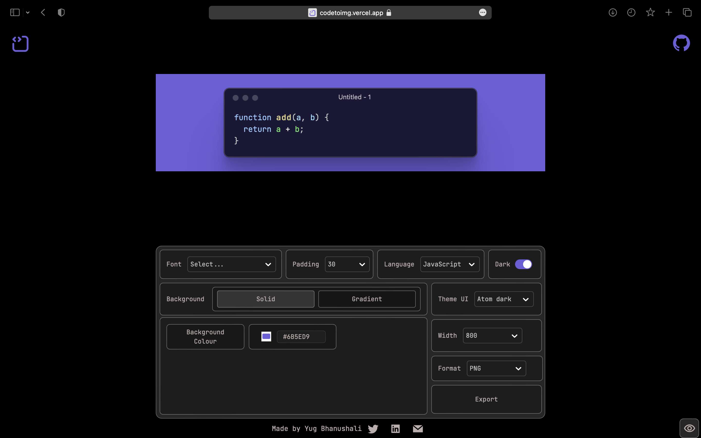

# Code to Image

Code to Image is the app which can be used to create beautiful snippets of your code with customizable background, font styles, theme UI, Dark mode, and other more features and also allow user to download the snippet in different format e.g PNG,JPEG, and SVG.

## How to Use

1. Clone the repository or download the code.
2. Install the dependencies using `npm install`.
3. Start the development server using `npm run dev`.
4. Go to `http://localhost:3000` in your browser.
5. Type in your code snippet into the editor.
6. Click the "Generate Image" button to generate a beautiful image of your code snippet.
7. You can download the generated image by right-clicking on it and selecting "Save image as".

## Dependencies

- React
- Vite
- Styled Components
- Redux
- PrismJS
- html-to-image

## Contributing

Contributions are welcome! If you find a bug or have a feature request, please open an issue on GitHub. If you want to contribute code, please open a pull request with your changes.

## License

This project is licensed under the MIT License. See the `LICENSE` file for more information.
